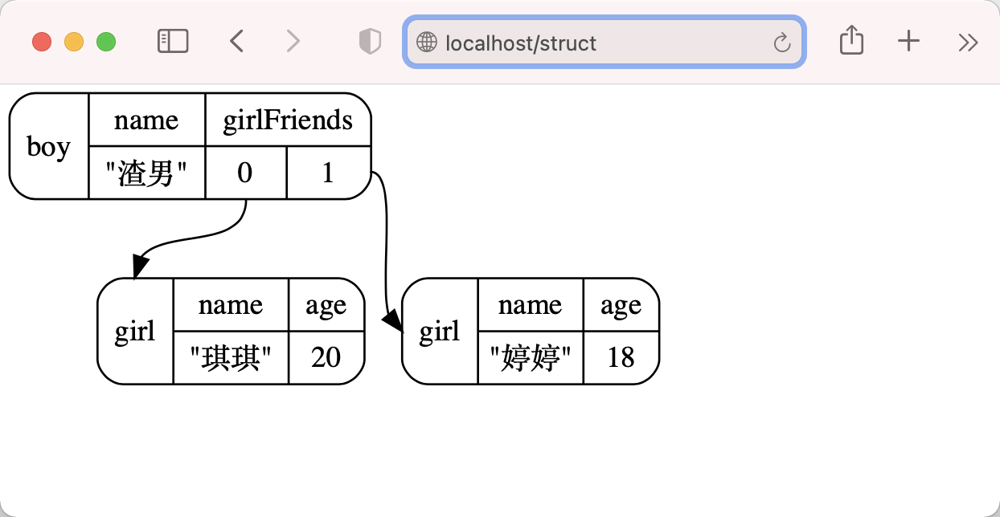

draw包可以画出go的数据结构。
# example
运行
```shell script
go run example/main.go
```
打开浏览器访问 ```localhost/struct```将会得到以下代码svg格式的图片
```go
	type girl struct {
		name string
		age int
	}
	type boy struct {
		name string
		girlFriends []girl
	}

	item := boy{
		name: "渣男",
		girlFriends: []girl{ {"琪琪", 20}, {"婷婷", 18}},
	}
```
图片：


# redis
运行
```shell script
go run redis/main.go
```
按key画图
```shell script
localhost?key=my_stream
```
