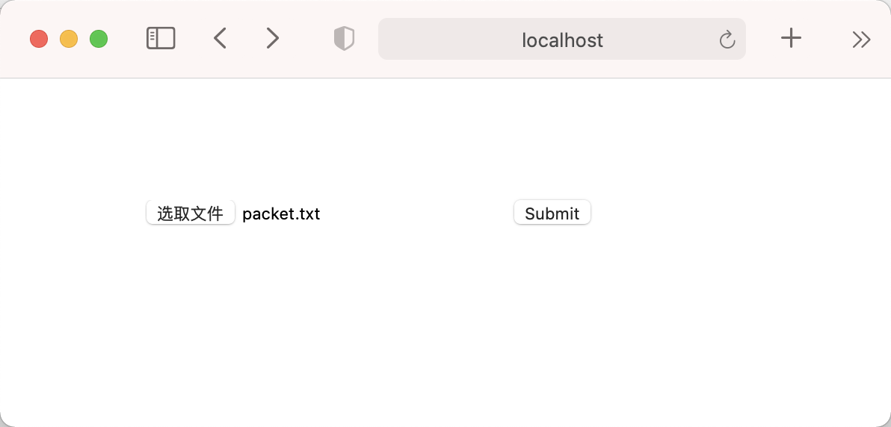

# 文件的上传、下载

## 关于form表单上传文件
* [深入解析 multipart/form-data](https://www.jianshu.com/p/29e38bcc8a1d)
* [使用multipart/form-data实现文件的上传与下载](https://tonybai.com/2021/01/16/upload-and-download-file-using-multipart-form-over-http/)

## 上传
```shell script
go run up_file.go
```
打开浏览器，访问 http://localhost:9000/

服务器命令行输出:
```
Server started at port 9000
fileName:packet.txt, fileSize:521.82k
```