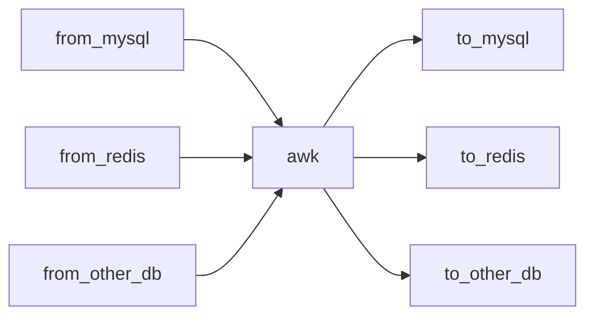
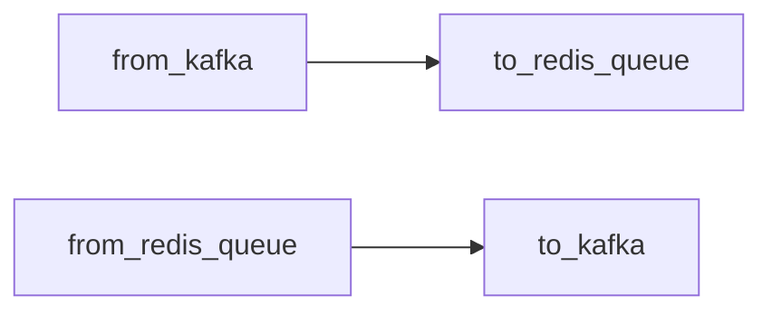

# 如何使用
利用管道，让各个程序职责更加单一

### 利用awk处理数据格式
```shell script
from_mysql | awk | to_redis
```
数据流向图  

```mermaid
graph LR;
    from_mysql-->awk;
    from_redis-->awk;
    from_other_db-->awk;
    awk-->to_mysql;
    awk-->to_redis;
    awk-->to_other_db;
```
### 有些情况也可以省略awk

```mermaid
graph LR;
from_kafka-->to_redis_queue;
from_redis_queue-->to_kafka;
```
