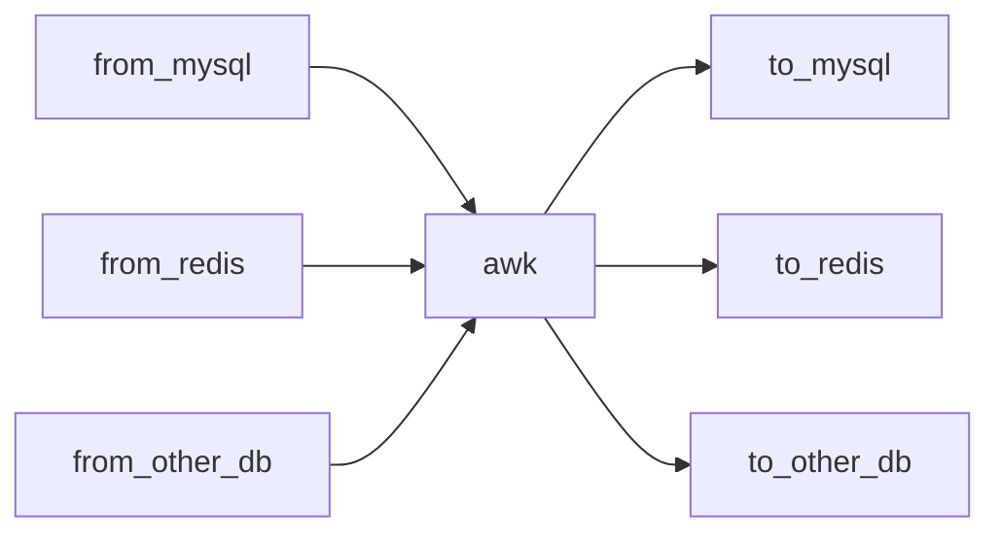
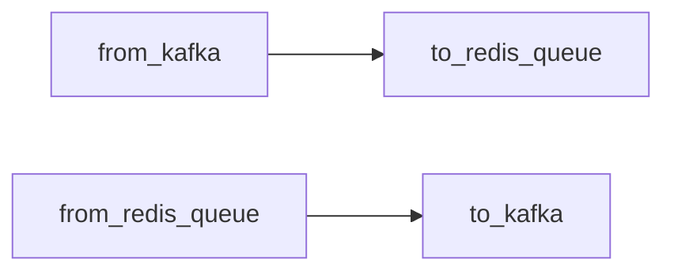

# 如何使用
导数据工具，整体设计利用管道，让各个程序职责更加单一。非常灵活的组合使用

* 利用awk处理数据格式
```shell script
from_mysql | awk | to_redis
```
数据流向图
注意：如果看到的是代码，需要浏览器安装[插件](https://chrome.google.com/webstore/detail/github-%20-mermaid/goiiopgdnkogdbjmncgedmgpoajilohe)  

* 有些情况也可以省略awk

### 一个具体的使用过程
* 1、from_mysql
```shell 
./from_mysql \
  -dbhost=127.0.0.1 \
  -dbport=3306 \
  -dbuser=root \
  -dbname=test \
  -dbpassword=root \
  -sqltemplate="select f_id, f_ddate, f_pid, f_money, f_times from t_project_day limit 5" \
  -seq="|"
# 输出
#1023|2020-08-15|12|14280334|5862
#1024|2020-08-15|27|1793071|1264
#1025|2020-08-15|46|153606|187
#1026|2020-08-15|48|807675|774
#1027|2020-08-15|52|156965|131
```

* 2、awk
```shell script
cat from_mysql.out | awk -F"|" '{print "hmset gd:pb:{"$3"}:"$2" m "$4" t "$5}'

#输出
# hmset gd:pb:{12}:2020-08-15 m 14280334 t 5862
# hmset gd:pb:{27}:2020-08-15 m 1793071 t 1264
# hmset gd:pb:{46}:2020-08-15 m 153606 t 187
# hmset gd:pb:{48}:2020-08-15 m 807675 t 774
# hmset gd:pb:{52}:2020-08-15 m 156965 t 131
```

* 3、to_redis
```shell script

cat awk.out |  ./to_redis -redisAddr=127.0.0.1:6379

# [root@VM_236_135_centos]# redis-cli hgetall gd:pb:{12}:2020-08-15
# 1) "m"
# 2) "14280334"
# 3) "t"
# 4) "5862"
# [root@VM_236_135_centos]# redis-cli hgetall gd:pb:{12}:2020-08-15
# 1) "m"
# 2) "14280334"
# 3) "t"
# 4) "5862"
# [root@VM_236_135_centos]# redis-cli hgetall gd:pb:{27}:2020-08-15
# 1) "m"
# 2) "1793071"
# 3) "t"
# 4) "1264"
# [root@VM_236_135_centos]# redis-cli hgetall gd:pb:{46}:2020-08-15
# 1) "m"
# 2) "153606"
# 3) "t"
# 4) "187"
# [root@VM_236_135_centos]# redis-cli hgetall gd:pb:{48}:2020-08-15
# 1) "m"
# 2) "807675"
# 3) "t"
# 4) "774"
# [root@VM_236_135_centos]# redis-cli hgetall gd:pb:{52}:2020-08-15
# 1) "m"
# 2) "156965"
# 3) "t"
# 4) "131"
```

### 综上
```shell script
./from_mysql   --dbhost=127.0.0.1   --dbport=3306  --dbuser=root  --dbname=test --dbpassword=root \
  --sqltemplate="select f_id, f_ddate, f_pid, f_money, f_times from t_project_donation_day_special limit 5" \
  --seq="|" |  awk -F"|" '{print "hmset gd:pb:{"$3"}:"$2" m "$4" t "$5}' |  ./to_redis -redisAddr=127.0.0.1:6379
``` 


# to_redis
### 参数描述
```shell script
./to_redis --help
Usage of ./to_redis/to_redis:
  -msgQueueLen int
        生产者队列长度 (default 5000)
  -redisAddr string
        redis 地址 (default "127.0.0.1:6379")
  -redisPass string
        redis 密码
  -workerNum int
        工作协程数 (default 1)
```
### 使用
```shell script
echo "set key1 value1 \n set key2 value2"| ./to_redis
```
### todo
```shell script
# 暂不支持如下带引号的string
echo 'set key1 "value 1"' | ./to_redis
```
