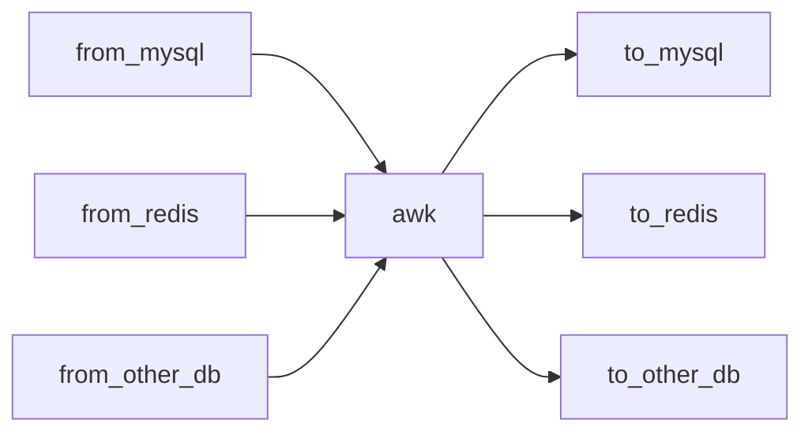
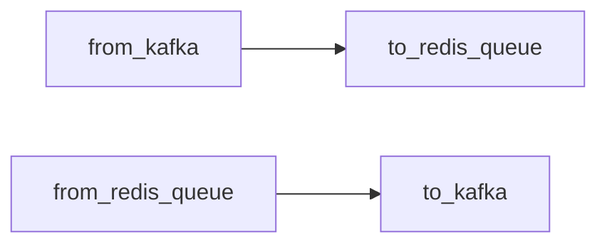

# 如何使用
导数据工具，整体设计利用管道，让各个程序职责更加单一。非常灵活的组合使用

### 利用awk处理数据格式
```shell script
from_mysql | awk | to_redis
```
数据流向图
注意：如果看到的是代码，需要浏览器安装[插件](https://chrome.google.com/webstore/detail/github-%20-mermaid/goiiopgdnkogdbjmncgedmgpoajilohe)  

### 有些情况也可以省略awk



# to_redis
### 参数描述
```shell script
./to_redis --help
Usage of ./to_redis/to_redis:
  -msgQueueLen int
        生产者队列长度 (default 5000)
  -redisAddr string
        redis 地址 (default "127.0.0.1:6379")
  -redisPass string
        redis 密码
  -workerNum int
        工作协程数 (default 1)
```
### 使用
```shell script
echo "set key1 value1 \n set key2 value2"| ./to_redis
```
### todo
```shell script
# 暂不支持如下带引号的string
echo 'set key1 "value 1"' | ./to_redis
```
