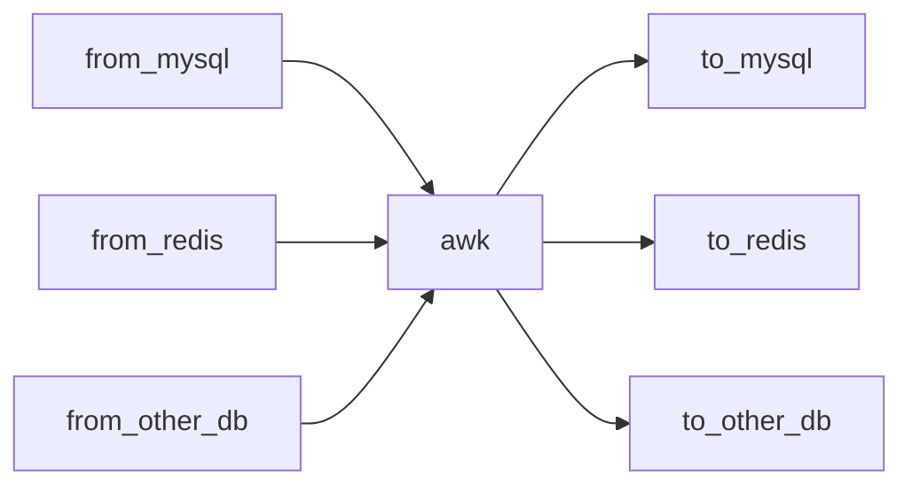
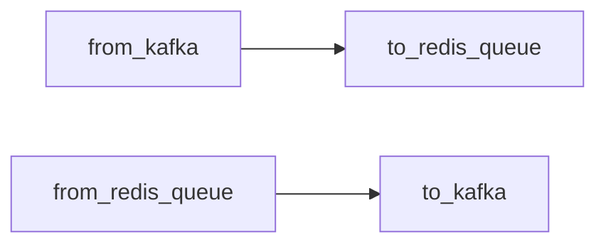

# 如何使用
导数据工具，整体设计利用管道，让各个程序职责更加单一。非常灵活的组合使用

### 利用awk处理数据格式
```shell script
from_mysql | awk | to_redis
```
数据流向图
注意：如果看到的是代码，需要浏览器安装[插件](https://chrome.google.com/webstore/detail/github-%20-mermaid/goiiopgdnkogdbjmncgedmgpoajilohe)  

### 有些情况也可以省略awk

